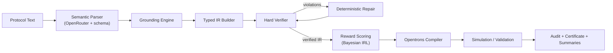

# ProtocolIR

ProtocolIR is a safety-first compiler for autonomous lab protocols.
It transforms natural-language protocol instructions into verified Opentrons Python by using a structured semantic parser, typed intermediate representation (IR), deterministic safety verification and repair, reward scoring, compilation, and execution artifacts.

## Live Demo

- Streamlit app: `https://scifry-scspgit-cusv4klr3xnmzoy7hyjhpc.streamlit.app/`
- Cloud app entrypoint: `ProtocolIR/cloud_app/app.py`

## Why ProtocolIR

Direct LLM code generation is powerful but brittle for safety-critical lab workflows.
ProtocolIR separates concerns:

- LLM for structured semantic extraction only
- Deterministic compiler pipeline for execution
- Hard verifier for physical and semantic constraints
- Auditable artifacts for reproducibility and review

## Architecture



## Safety Guarantees Enforced

The verifier checks constraints such as:

- no aspirate/dispense/mix without a tip
- pipette range and tip capacity limits
- no cross-contamination between reagents
- valid source/destination locations
- no well overflow
- no dropping tips with residual liquid
- missing mix after dispense detection

## Installation

### Linux/macOS

```bash
cd ProtocolIR
python3 -m venv .venv
source .venv/bin/activate
pip install --upgrade pip
pip install -r requirements.txt
```

### Windows (PowerShell)

```powershell
cd ProtocolIR
py -3.11 -m venv .venv
.\.venv\Scripts\Activate.ps1
python -m pip install --upgrade pip
python -m pip install -r requirements.txt
```

## Configuration

Set required environment variables before live parsing:

```bash
export OPENROUTER_API_KEY="YOUR_OPENROUTER_KEY"
export PROTOCOLIR_MODEL="inclusionai/ling-2.6-flash:free"
```

Never commit secrets.

## Usage

### Step-by-step pipeline run

```bash
python test_installation.py
python check_openrouter.py
python train_reward_model.py
python main.py --demo -o outputs_demo
python compare_systems.py --demo -o comparison_output
streamlit run app_protocolir.py
```

### One-command end-to-end run

```bash
python run_demo_bundle.py -o demo_bundle_output
```

This command generates a complete run bundle, including logs and output artifacts.

## Output Artifacts

Typical generated files include:

- `protocol.py` (compiled Opentrons script)
- `audit_report.md` (human-readable report)
- `summary.txt` (compact run summary)
- `safety_certificate.json` (machine-readable verdict)
- `risk_summary.json` (risk/severity breakdown)
- `dependency_summary.json` (root-cause dependency analysis)
- `comparison_report.md` (baseline vs ProtocolIR, when using `compare_systems.py`)

## Deploy on Streamlit Community Cloud

Use the cloud-safe app:

- App file: `ProtocolIR/cloud_app/app.py`
- Requirements: `ProtocolIR/cloud_app/requirements.txt`
- Runtime: `ProtocolIR/cloud_app/runtime.txt`
- Replay scenarios data: `ProtocolIR/cloud_app/scenarios/`

In Streamlit app secrets, set:

```toml
OPENROUTER_API_KEY = "your_key_here"
PROTOCOLIR_MODEL = "inclusionai/ling-2.6-flash:free"
```

Note: the cloud app is designed for broad compatibility and may skip local Opentrons simulation depending on environment constraints.

Cloud UI modes:

- **Replay Scenarios**: deterministic, baked-in evidence cases (including expected-failure variants).
- **Live Run**: real cloud-safe execution on user-provided protocol text.

## Core Modules

```text
protocolir/
  llm.py                 Structured semantic parsing adapter
  parser.py              Protocol text -> semantic actions
  grounder.py            Deck/labware/well grounding
  ir_builder.py          Typed IR construction
  verifier.py            Hard safety checks
  repair.py              Deterministic IR repairs
  reward_model.py        Reward scoring from learned weights
  compiler.py            IR -> Opentrons Python
  simulator.py           Opentrons simulation integration
  audit.py               Audit and summary generation
  orchestration.py       End-to-end pipeline execution
```

## Current Scope

ProtocolIR is strongest today on liquid-handling workflows (PCR/qPCR-style tasks) and continues to improve for broader protocol classes.
